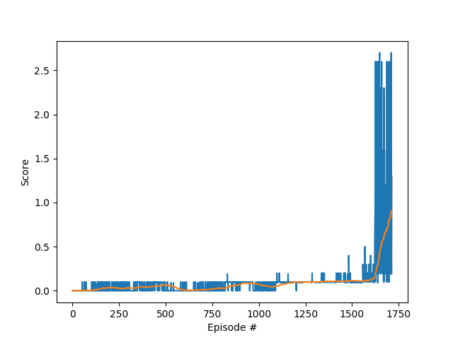

# Project 3: Collaboration and Competition
## Saminda Abeyruwan

### Introduction

In this project, we have successfully trained and evaluated an agent to solve the [Tennis](https://github.com/Unity-Technologies/ml-agents/blob/master/docs/Learning-Environment-Examples.md#tennis) environment.

### Environment

In this environment, two agents control rackets to bounce a ball over a net. If an agent hits the ball over the net, it receives a reward of +0.1.  If an agent lets a ball hit the ground or hits the ball out of bounds, it receives a reward of -0.01, otherwise it receives a reward of 0. Thus, the goal of each agent is to keep the ball in play.

The task is episodic, and in order to solve the environment, our agents must get an average score of +0.5 (over 100 consecutive episodes, after taking the maximum over both agents). 

- After each episode, we add up the rewards that each agent received (without discounting), to get a score for each agent. This yields 2 (potentially different) scores. We then take the maximum of these 2 scores.
- This yields a single **score** for each episode.

### State and Action Representation

The observation space consists of 8 variables corresponding to the position and velocity of the ball and racket. Each agent receives its own, local observation, and the observation vector has 24 features.  Two continuous actions are available, corresponding to movement toward (or away from) the net, and jumping. 

### DDPG

We have implemented the Deep Deterministic Policy Gradient ([DDPG](https://arxiv.org/abs/1509.02971)) algorithm to train our agent. We have bootstrapped our implementation from DDPG implementation available for [BipedalWalker](https://github.com/udacity/deep-reinforcement-learning/tree/master/ddpg-bipedal) and modified for our problem. The modification are:

- Both pedals are controlled by a single agent. 
- We have added batch normalization ([BatchNorm1d](https://pytorch.org/docs/stable/nn.html)) in both Actor and Critic. 
- We have used a simple global buffer, which accumulated local experiences from both pedals. 
- We have kept the hidden layers relatively smaller sizes (e.g., 64 and 128 units) to faster training.
- We have trained the agent on every 20 steps, which accumulate 40 new examples, for 10 repetitions. 
- We have clipped the critic parameters to 1 units. 

### Training

There are many knobs to tune in the algorithm. The parameters that worked best for me are:

| Parameter      | Value         | 
| ---------------|:-------------:| 
| buffer\_size |  1000000        |
| batch\_size  |  1024        |
| gamma   |     0.99        |
| learning\_rate\_actor  |    0.0001        |
| learning\_rate\_critic  |    0.001        |
| update\_step |    20        |
| update\_per\_step  |   10        |

We have used Adam as the optimizer. The agent has solved the problem within __1655 episodes__. The weights are saved in [solution_actor.pth](solution_actor.pth) and [solution_critic.pth](solution_critic.pth).

Following is the learning trace (up to solving the problem):

	Episode 100, Average Score: 0.00, Max: 0.00, Min: -0.01
	Episode 200, Average Score: 0.04, Max: 0.10, Min: -0.01
	Episode 300, Average Score: 0.03, Max: 0.00, Min: -0.01
	Episode 400, Average Score: 0.04, Max: 0.09, Min: 0.00
	Episode 500, Average Score: 0.07, Max: 0.00, Min: -0.01
	Episode 600, Average Score: 0.01, Max: 0.00, Min: -0.01
	Episode 700, Average Score: 0.01, Max: 0.10, Min: -0.01
	Episode 800, Average Score: 0.03, Max: 0.00, Min: -0.02
	Episode 900, Average Score: 0.07, Max: 0.09, Min: 0.00
	Episode 1000, Average Score: 0.07, Max: 0.00, Min: -0.01
	Episode 1100, Average Score: 0.06, Max: 0.09, Min: 0.00
	Episode 1200, Average Score: 0.10, Max: 0.09, Min: 0.00
	Episode 1300, Average Score: 0.10, Max: 0.10, Min: 0.09
	Episode 1400, Average Score: 0.11, Max: 0.10, Min: 0.09
	Episode 1500, Average Score: 0.11, Max: 0.10, Min: -0.01
	Episode 1600, Average Score: 0.13, Max: 0.40, Min: 0.39
	Environment solved in 1655 episodes!    Average Score: 0.50

### Testing

The trained agent has achieved maximum reward of  __0.7__ on the test environment. To run on the test environment:

	python3 eval.py --file_name=path/to/Tennis.app
	
The video available at the top of the discussion shows the agent's behavior.

### Ideas for Future Work

In this project, we have committed to implement the agent using DDPG algorithm. There are other distributed algorithms we could have used to solve the environment and compare the performance, such as A3C, [PPO](https://arxiv.org/pdf/1707.06347.pdf), [D4PG](https://openreview.net/pdf?id=SyZipzbCb), [DDPG](https://arxiv.org/pdf/1509.02971.pdf), [Q-PRO](https://arxiv.org/pdf/1611.02247.pdf), [Off-Policy Actor-Critic](http://incompleteideas.net/papers/Degris-OffPAC-ICML-2012.pdf), so on. In addition, after I have also investigated using [MADDPG](https://arxiv.org/pdf/1706.02275.pdf) to solve the problem. Even though after trying many attempts, I was not able to find a stable solution. 

